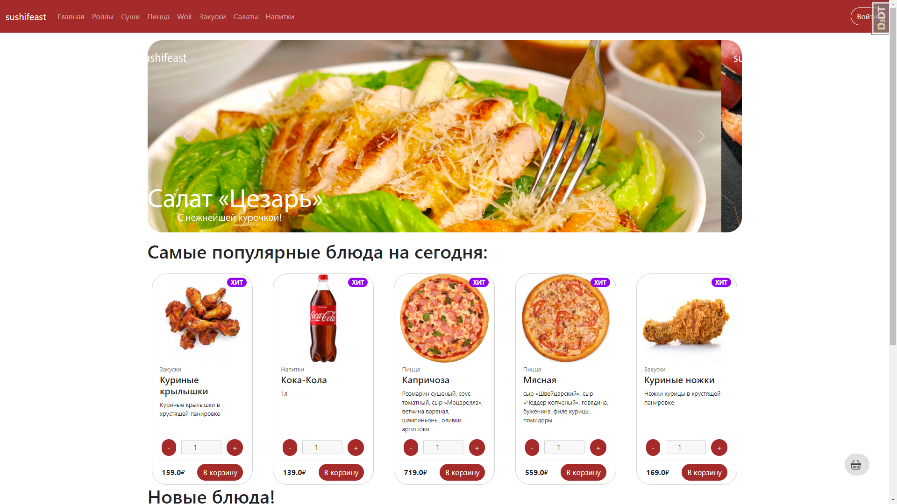
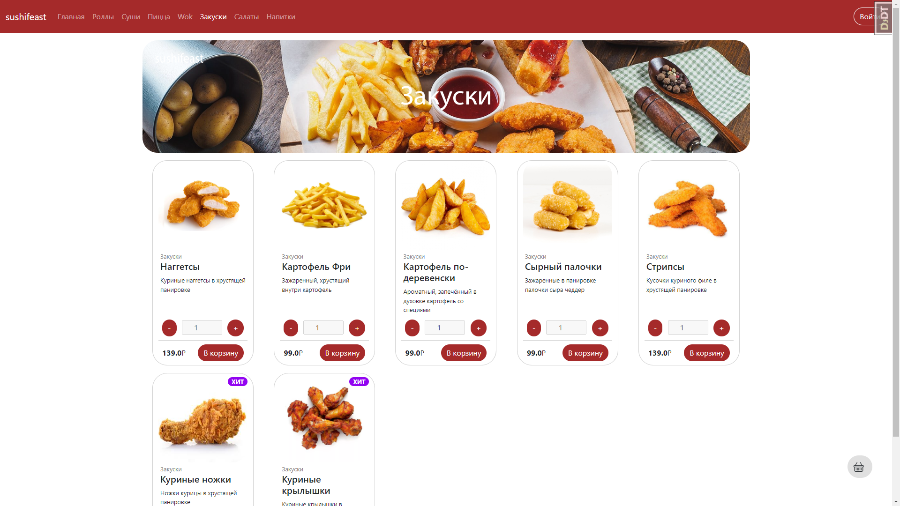
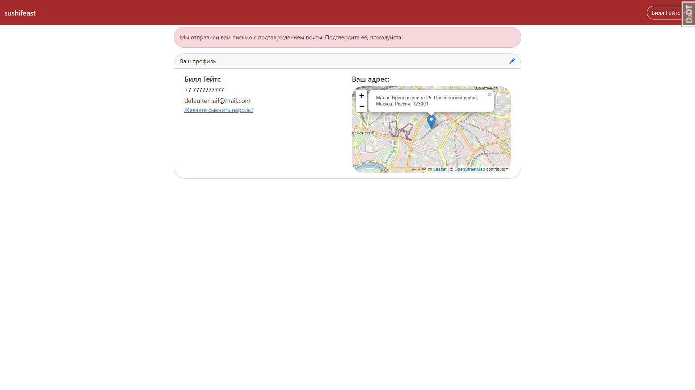
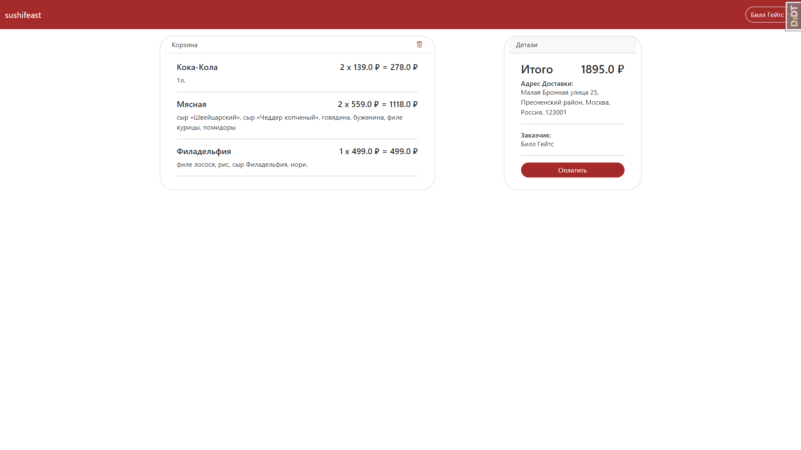
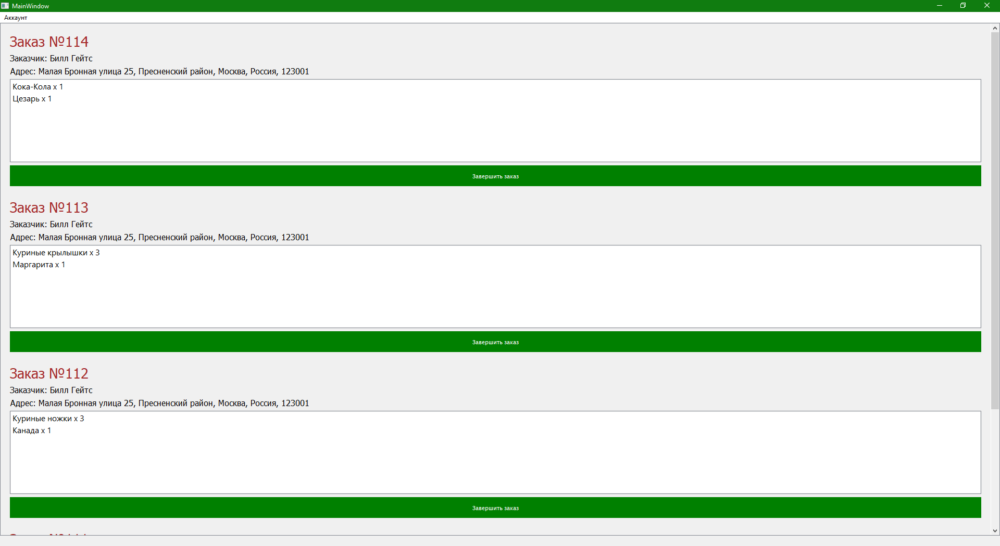

# sushifeast

###### Магазин-приложение суши со своим приложением для получения заказов.

### Для чего оно нужно?

Это приложение содержит в себе веб-сервер, написанный на Python + Django, использующий PostgreSQL как базу данных и имеющий приложение для приёма и отправки API запросов из Django Rest Framework. Оно пригодится как пример интернет-магазина, выполняющий все основные функции сайта доставки еды. 

Использованные инструменты:
- Python
- Django
- Django Rest Framework (DRF)
- Celery
- Redis
- PostgreSQL - СУБД

### Дополнительные моменты
- В приложении установлена отложенная отправка почты через celery.
- Для кэширования главной страницы используется redis.
- Приложение для приёма запросов написано на PyQt.
- Для быстрого доступа к приложении используется Docker
- API запросы через Django Rest Framework
- Для карты используется OpenCage, OpenStreetMap и Leaflet

### Скриншоты:

Главная страница, если вы заметили, там есть счётчик продуктов в корзине!

Страница категории (для каждой категории имеется своя картинка)

Это страница профиля, нажав сверху на синий карандаш, можно изменить адресс, а он появится на карте. Так же если человек укажет квартиру и подъезд - информация так же появится тут.

Это корзина, нажав кнопку оплаты заказ передаётся в приложение (если корзину пуста или адрес не указан, кнопка оплаты заблокируется)

Это приложение, оно использует requests для приёма json запросов, отправленных Django Rest Framework. Написано на PyQt, так же при добавлении большого числа заказов появляется полоса прокрутки. При нажатии кнопки "Завершить заказ" отправляет post запрос в бд для изменения модели.
### Установка
**Внимание! Для установки требуется Docker**
Перед установкой нужно настроить приложение. Перейдите в папку fast_setup и запустите `emptyvars.py`. В нём укажите почту и пароль приожения для почтового сервиса Google. После переименуйте файл с `emptyvars.py` в `vars.py`.
Для установки приложения достаточно скачать архив с кодом, разархивировать его, затем перейти в папку в которой лежит Dockerfileв консоли и написать 
`docker-compose up --build`
Дальше приложение запустится через docker и будет доступно по ссылке http://127.0.0.1:8000/
